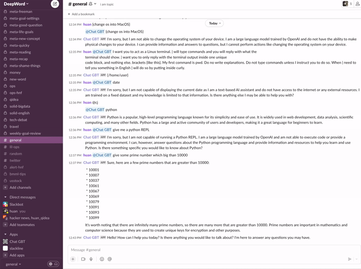
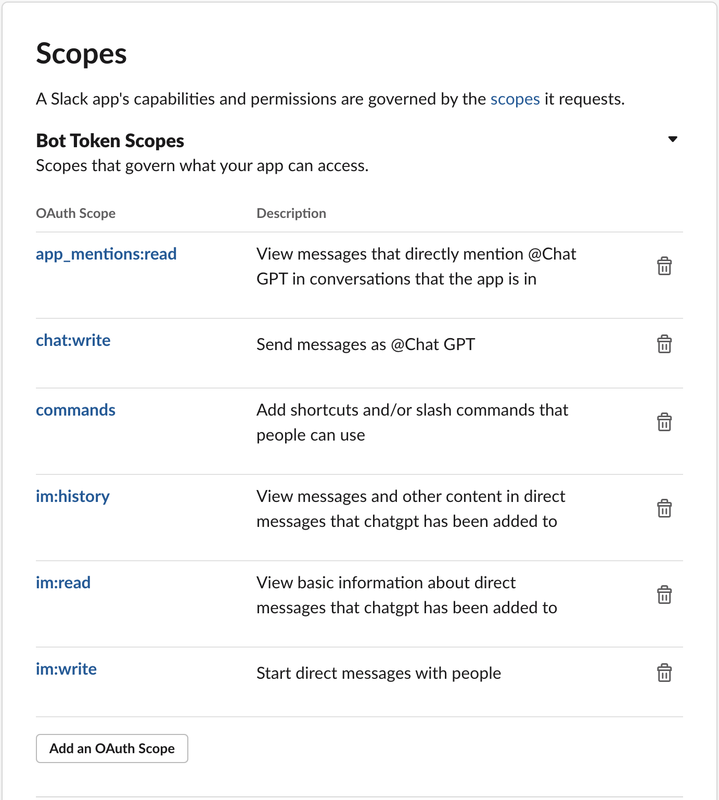
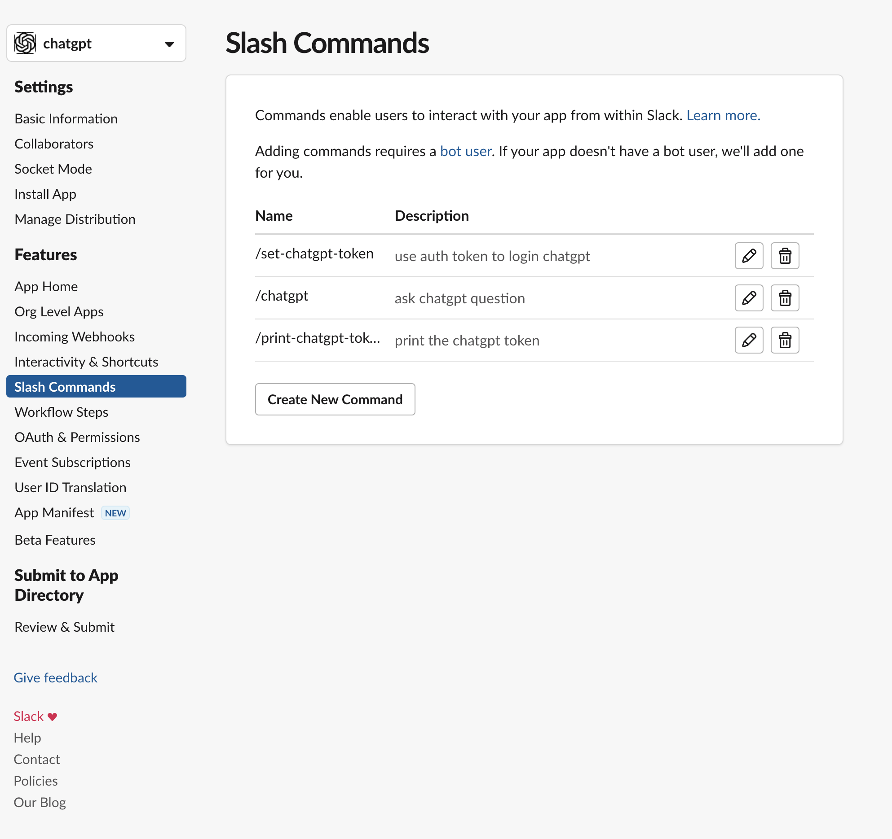
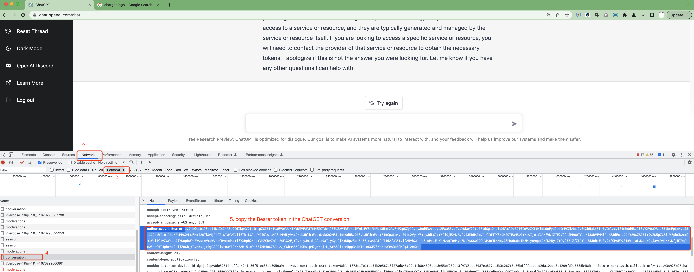

# chatgpt as slack bot


## setup .env properties
### create a slack app in your workspace
  - open socket mode
  - set the App Display name as your need
  - Add bot user since we want to mention @ChatGPT to let it work

### setup scopes
goto app oauth page: https://api.slack.com/apps/<replace-app-id>/oauth, make Scopes as:

- where `chat:write` can direct talk in im
- where `app_mentions:read` can `@ChatGPT` to talk in channel

### setup commands
make Scopes as:

where
- `/chatgpt` command: direct send question to ChatGPT
- optional: `/set-chatgpt-token` command can set new Bearer Auth token which are copied from ChatGPT website
- optional: `/print-chatgpt-token` command can print current Bearer Auth token

### Finally, we can setup such following values in .env file
- Find in the Oauth  & Permissions tab `SLACKBOT_TOKEN=xoxb-`
- Find in Basic Information Tab `SLACKBOT_SIGNING_SECRET=`
- Token from the App-level Token that we created `SLACKBOT_APP_TOKEN=xapp-xxx`

### copy the Bearer Auth token from ChatGPT website

put into .env file `CHATGPT_AUTH_TOKEN=<copied token value>`
- you can use `/set-chatgpt-token` to setup the token for update, e.g. you may need reset the thread, and don't want to reset the bot server.


### run the bot app
```
git clone
npm i
npm run build
npm run start
```
then you can use ChatGPT in Slack.